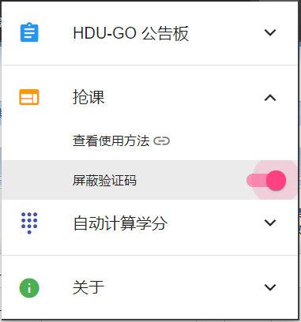
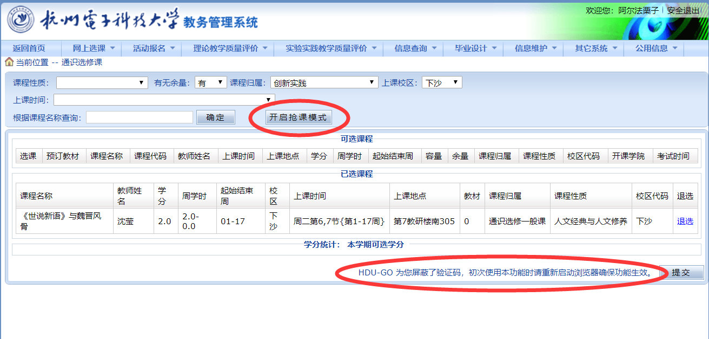
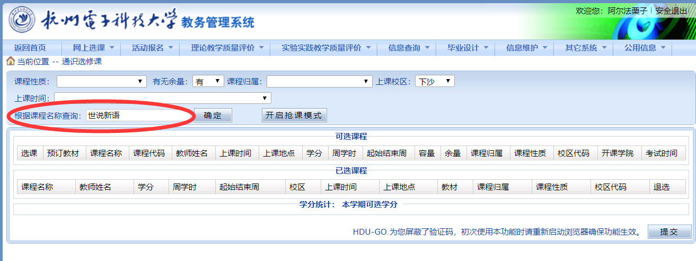
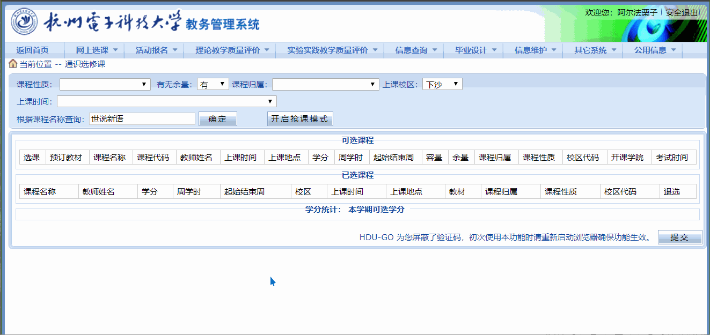
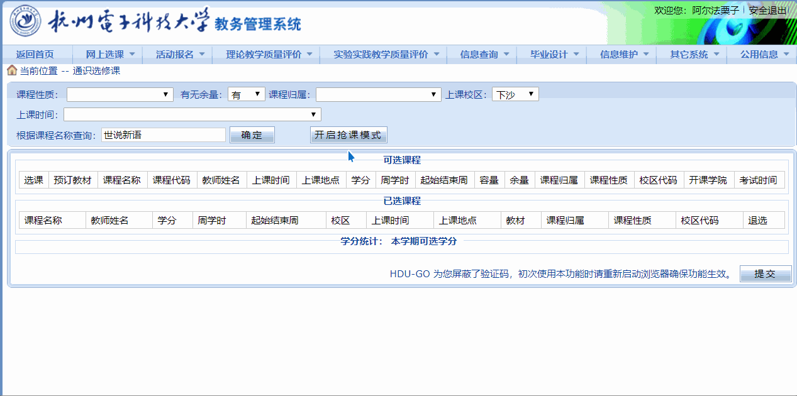

### 抢课/捡漏（示范：捡《世说新语》这门课）

##### 第一步、点击浏览器右上扩展栏的 HDU-GO ，启用屏蔽验证码功能。

> **注意！！！**
> 
> 每次重新开启屏蔽验证码功能都需要重新启动一下浏览器，主要是为了把 cookie 清空！

##### 第二步、进入数字杭电教务系统 -> 网上选课 -> 通识选修课，可以看到多了一个“开启抢课模式”的按钮。而且下方的验证码也直接被消除了。

##### 第三步、在筛选项里填写好你要筛选的条件，确保如果你想捡漏的课程有余课的话，一定会出现在表格里。

##### 第四步、点击“开启抢课模式”，页面就会自动刷新，为你查询是否有余课。浏览器不要关闭，这个时候你可以去安心做你的事情。

##### 第五步、当出现有余课，程序会自动给你抢到碗里来~

