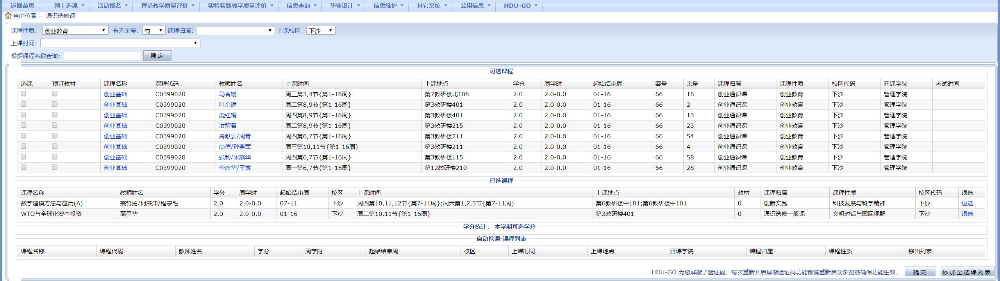
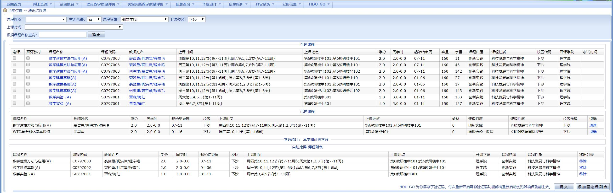
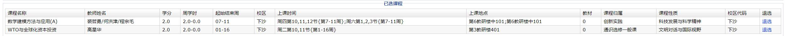

### 抢课/捡漏（示范：捡《 数学建模方法与应用 》这门课）

##### 第一步、点击浏览器右上扩展栏的 HDU-GO ，启用屏蔽验证码功能。

> **注意！！！**
> 
> 每次重新开启屏蔽验证码功能都需要重新启动一下浏览器，主要是为了把 cookie 清空！

##### 第二步、进入数字杭电教务系统 -> 网上选课 -> 通识选修课，可以看到在下方多了一个“自动抢课-课程列表”的表单和一个“添加至选课列表”的按钮。而且下方的验证码也直接被消除了。

##### 第三步、在筛选项里填写好你要筛选的条件，选中你想要抢的课程，之后点击“添加至选课列表”。

##### 第四步、点击上方的“HDU-GO”选项卡并选择“自动抢课”，页面就会自动刷新，为你查询是否有余课。浏览器不要关闭，这个时候你可以去安心做你的事情。

##### 第五步、当抢课列表中的任意课程出现余课，程序会自动给你抢到碗里来~你可以再次点击“HDU-GO”选项卡中的“自动抢课”选项来停止自动抢课（可以同时抢抢课列表中的全部课程，此处不做演示）

##### 第五步、抢课成功~祝大家学习愉快

### tips:

### 1、由于自动抢课列表储存在本地localstorage中，您可以任意刷新、跳转或关闭页面，您的选择结果不会被清除。您可以点击列表旁边的“移除”选项来删除该课程

### 2、您可以将多次搜索结果放入抢课列表中，也可以一次选择多个结果